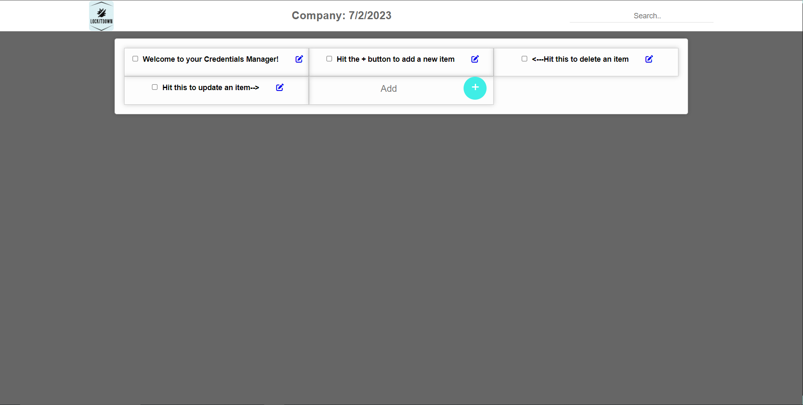

#LockitDown

This application was created for multiple users to keep and guard their credentials. The rise of cybercrime has increased security requirements, causing users to have multiple passwords scattered across different apps. This increases safety but makes it a hassle to find their credentials.

This app not only requires IP addresses to access the user's credentials, but the session also terminates after 5 minutes of inactivity. Passwords are hashed using bcrypt. Users can create separate companies or a general category to display all their credentials.

Screenshot of the app is below

Technologies uses:
* EJS
* Express
* Bcrypt
* Mongoose
* Session-express
